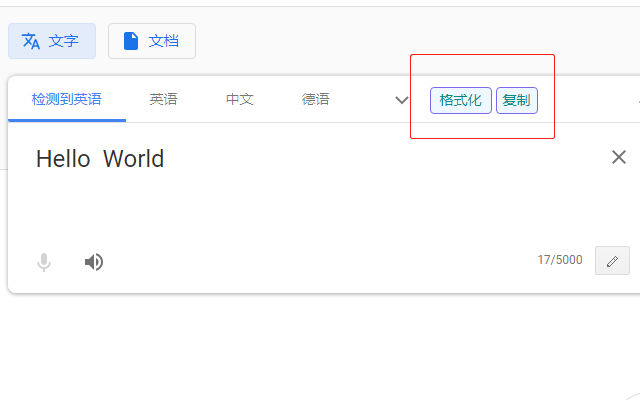

本文档仅为记录在谷歌应用店上架本拓展时，所填写内容的记录。

# 商品详情

## 说明
（注：manifest.json中的description不用在这里重复填写）

插件名：翻译助手
功能如下：
1. 点击“格式化”按钮，可自动去除待翻译文本中的换行符。（默认打开，选项中还有细化配置）
2. 可设置“格式化”按钮的键盘快捷键。（默认打开，快捷键为“ctrl+/”）
3. 点击“复制”按钮，一键复制翻译结果。（默认打开）
4. 翻译网页上按下 backspace 键，焦点将回到原文输入框。（需在选项中打开）
5. 同时按下 shift 和 backspace 键（应先按 shift 键），可直接清空原文输入框内容。（需在选项中打开）

由于翻译网页可能更新，如果上述功能某些失效了，请通过Github或者邮箱联系作者，谢谢。

## 类别

效率

## 语言

中文（中国）

## 商店图标

## 屏幕截图

## 首页网址

https://github.com/And-ZJ/TranslateHelper

# 隐私权规范

## 单一用途

在百度、谷歌、有道、必应、搜狗等翻译网页页面，按下“格式化”键，可去除待翻译文本框中的换行符。本拓展提供提升用户使用翻译网页使用体验的几个小功能。功能列表请见说明。

## 需请求storage的理由

本拓展使用了Chrome提供的标准API来实现存储用户个性化设置的功能。当用户对本拓展提供的功能进行了个性化设置之后，每次使用拓展时，都将自动应用上一次的设置，而无需用户反复设置。这样极大提升了用户使用本拓展的使用体验。
同时，本扩展仅使用相关API保存、加载与该拓展有关的个性化设置，不会存储其他内容。
最后，个性化设置的存储位置均由Chrome提供，开发者无法通过相关API来获取用户的个性化设置，开发者不会侵犯用户的隐私。

## 需请求主机权限的理由

本拓展提供的功能需要在指定翻译网页上才能使用，所以，本拓展需要特定网页的权限。
拓展中列举出的翻译网页均为本拓展可生效的网页。在其他网页上，本拓展不会生效。
同时，在扩展程序设置中，用户可以进一步控制是否授予本拓展访问相关翻译网页的权限。

## 您正在使用远程代码吗？

不，我并未使用远程代码

## 我确认下列披露信息均属实：

我不会出于已获批准的用途之外的用途向第三方出售或传输用户数据

我不会为实现与我的产品的单一用途无关的目的而使用或转移用户数据

我不会为确定信用度或实现贷款而使用或转移用户数据

## 