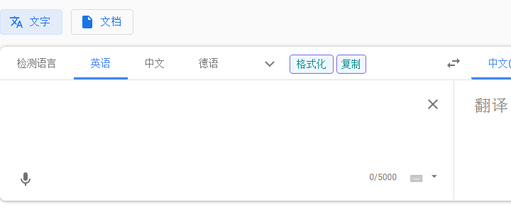
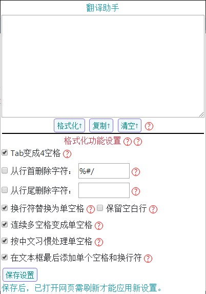
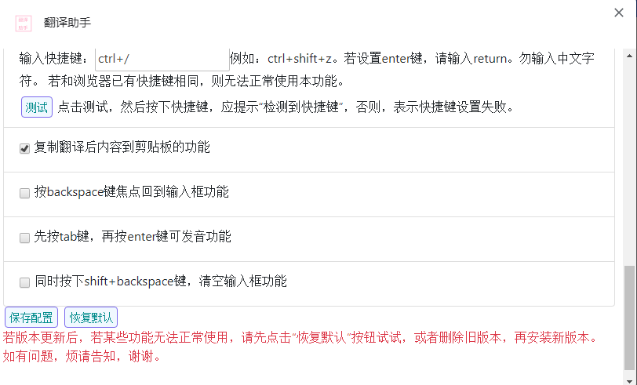

[TOC]

# Chrome 浏览器 翻译助手插件

## 插件名

翻译助手 TranslateHelper

## 用途

在常见的网页翻译网页（百度翻译、谷歌翻译、有道翻译、必应翻译、搜狗翻译）的页面上，提供如下方便实用小功能：

1. 点击“格式化”按钮，可自动去除待翻译文本中的换行符。（默认打开，选项中还有细化配置）
2. 可设置“格式化”按钮的键盘快捷键。（默认打开，快捷键为“ctrl+/”）
3. 点击“复制”按钮，一键复制翻译结果。（默认打开）
4. 翻译网页上按下 backspace 键，焦点将回到原文输入框。（需在选项中打开）
5. 同时按下 shift 和 backspace 键（应先按 shift 键），可直接清空原文输入框内容。（需在选项中打开）

由于翻译网页可能更新等缘故，如果上述功能失效了，请通过Github或者邮箱联系作者，谢谢。

由于应用商店需审核等原因，最新版本请前往Github查看。

## 可使用的网页翻译页面

1. 百度翻译：https://fanyi.baidu.com/
2. 谷歌翻译：https://translate.google.cn/、https://translate.google.com.hk/、https://translate.google.com
3. 有道翻译：http://fanyi.youdao.com/
4. 必应翻译：https://cn.bing.com/translator/
5. 搜狗翻译：https://translate.sogou.com/、https://fanyi.sogou.com/

## 本插件更新地址

Github地址：[https://github.com/And-ZJ/TranslateHelper](https://github.com/And-ZJ/TranslateHelper)

Chrome网上应用店地址：[https://chrome.google.com/webstore/detail/翻译助手/ldhdmpimmbbjemmbklofidofnkgpakaa](https://chrome.google.com/webstore/detail/%E7%BF%BB%E8%AF%91%E5%8A%A9%E6%89%8B/ldhdmpimmbbjemmbklofidofnkgpakaa)

## 如何在线安装

可能只有Chrome浏览器能直接从应用商店安装。

注意，此方法需要您能够正常访问 Google，如果您无法访问下述安装地址，则可以尝试本地安装。

步骤如下：

1. 进入 [Chrome网上应用店安装地址](https://chrome.google.com/webstore/detail/%E7%BF%BB%E8%AF%91%E5%8A%A9%E6%89%8B/ldhdmpimmbbjemmbklofidofnkgpakaa) 。
2. 点击“添加至Chrome”。
3. 在弹出的“要添加‘翻译助手’吗？”的对话框中，选择“添加拓展程序”。
4. 等待片刻安装完成。

关于“解压缩失败”的问题说明：

  在测试这个插件的时候，点击“添加至Chrome”，反复几次都提示“解压缩失败”。然后，上传新版本后，但应用店还没有更新到新版时，再次添加却又成功了，所以暂时无法确定这个问题是网络原因还是包确实有问题引起的。

  如果您遇到了这个问题，可以在不同时间多尝试安装几次，或者，立即通过下方的联系方式中的邮箱反馈，非常感谢您的支持，谢谢。

## 如何在线更新

似乎会自动更新应用店的新版本。
如果在 Chrome 网上应用店 存在新版本，而没有自动更新时，
若想要手动更新，则其步骤如下：
1. 单击浏览器右上角“三点”选项按钮（通常在关闭浏览器的“×”按钮的下方）
2. 选择“更多工具”-->“拓展程序”
3. 勾选页面右上方“开发者模式”。
4. 点击新出现的“更新”按钮，等待出现左下角出现“拓展程序已更新”提示即可。
   注意，即便没有任何插件需要更新，还是会出现这个提示，不过不影响。
5. 取消选中“开发者模式”。

## 如何本地安装

本安装方法，可能不适合最新版浏览器，但设置起来大同小异，请耐心设置。

0. 首先，在 Github 上[下载本插件](https://github.com/And-ZJ/TranslateHelper)。请点击页面上的“Clone or download”按钮后，再点击“Download ZIP”。下载到本地后，请解压，并最好存放到您常用的软件安装位置，以免误删除。

针对谷歌浏览器的安装方法：

1. 单击浏览器右上角“三点”选项按钮（通常在关闭浏览器“×”按钮的下方）
2. 选择“更多工具”-->“拓展程序”
3. 勾选页面右上方“开发者模式”
4. 点击“加载已解压的拓展程序”
5. 选择该插件文件夹的目录（或者是选中 manifest.json 文件），点击确定即可
6. 此时本插件已可以在上述页面（已打开的页面需要刷新）使用

针对QQ浏览器的设置方法（相关翻译页面需运行在极速模式下）

1. 打开QQ浏览器，进入“设置”，左侧选择“我的应用”图标
2. 上方选择“管理我的应用”
3. 右侧勾中“开发者模式”
4. 左侧选择“加载已解压的拓展程序”，弹出文件夹选择框
5. 选择本插件所在的文件夹，点击“确定”即可
6. 此时本插件已可以在上述页面（已打开的页面需要刷新）使用

其他可使用 Chrome 插件的浏览器设置类似（显然不支持 Microsoft Edge 或 IE 类浏览器）。

## 如何本地更新

若需要使用已发布到 Github 上的新版本，则需要手动更新，该插件不支持由Github自动更新。
更新步骤如下：
1. 按卸载插件的步骤，卸载本插件，并删除掉之前的本地旧版本代码。
3. 按本地安装的步骤，下载并安装最新版本插件即可。

注意：此种情况下，您在旧版本上的设置无法应用到新版本上来，新版本将默认使用默认配置。

## 如何卸载插件

如果您不需要使用本插件了，以Chrome浏览器为例，卸载步骤如下：

1. 鼠标右键点击该插件图标。
2. 在弹出菜单中，选择“从Chrome中移除...”，然后点击“删除”即可。
3. 如果是本地安装，则建议您再删除本地的代码。

## 如何对本插件进行个性化功能设置

本插件会在浏览器右上角显示一个蓝色背景、内有文字“助”的图标，如下所示。

当鼠标移到插件图标上方时，停顿一会儿，便会提示插件名字，即“翻译助手”。

通过**鼠标左键**点击本插件图标，可直接对“格式化”功能进行快速设置。

通过**鼠标右键**点击本插件图标，在弹出菜单中，点击“选项”按钮，可进行更多详细的功能设置。

请注意以下事项：

1. 一般更改设置并保存后，对于已打开的网页翻译界面，需要刷新后才能应用新的设置。
2. 默认的配置是只打开了“格式化”、“格式化的快捷键”和“复制翻译结果”这三个功能，其他功能需在“选项”设置中勾选。
3. “格式化”功能的默认配置是旧版本经典的“除换行”功能，也可以通过提供的细化功能设置，实现一些其他妙用。

## 部分截图展示

下面是部分截图，可能与最新版本或实际效果间存在些许差异。

### 在谷歌翻译网页上的样子

### 鼠标左键点击出现的设置

### 鼠标右键点击出现的选项设置

## 声明

1. 本插件开源，仅限学习交流，例如学习插件的简易开发。
2. 如使用本插件进行不当行为，本人不承担责任。
3. 如对上述网站构成侵权，请立即使用下方联系方式进行联系删除。
4. 本插件不采集任何个人或团体的公共或隐私信息，也不使用除Chrome以外的网络。
5. 从 Chrome 网上应用店 和 Github网站 可免费获取本插件内容。
6. 如需联系作者（例如：不能使用或出错了），可给下方的邮箱发邮件。

## 本插件网络使用问题详述

1. 本插件完全可以离线运行（但是翻译网页估计不能离线运行），运行时不需要从网络下载任何代码文件，也不会在联网时，向第三方网络传递消息。
2. 所谓第三方网络，是指除Chrome提供的API之外，可能实现网络通信的个人或企业网络。
3. 本插件仅利用Chrome提供的同步API接口，将您对本插件的更改设置保存并自动同步到多设备上，方便您的使用。例如您在某台计算机上对本插件设置进行了更改，那么，在另一台计算机的同账号下会自动同步该设置。
4. 该Chrome同步API接口可能会在联网之后，自动向其服务器传递消息，但作者不知晓、也不能控制此API在何时向何处发送本插件所期望其保存的内容。
5. 本插件仅期望通过该同步API接口保存和读取，您对本插件所进行的个性化功能设置。例如，保存是否选中“格式化”功能的标记。
6. 本插件不会向同步API接口或第三方网络发送，任何与您访问的网页或本地计算机文件等公共或隐私信息有关的内容。
7. 此外，当您在新的Chrome浏览器上登录了您的账号，该账号可能会自动下载并安装本插件，此为Chrome自动同步您的插件，就像自动同步您的书签一样，是一种方便用户使用的自动同步功能。此过程本插件是无法控制的，故不是本插件的“流氓”行为，如果您需要进行控制，似乎可以在您账户的同步选项中进行控制。
8. 代码完全开源，您随时可以检查。

## 注意事项

 1. 本地安装启用开发者模式后，每次打开谷歌浏览器，可能会提示:
      “请停用以开发者模式运行的拓展程序”等内容。
      这是正常现象，不是本插件有任何危害计算机或浏览器或网页的问题。
      您可以点击“x”按钮，不理会此消息。
      也可以在需要时去“拓展程序”中，启用本插件，而在不需要使用时，停止本插件。
      若从 Chrome 网上应用店 安装本插件，则并不需要启动开发者模式，也不会有此提示。

## 已知 Bug

1. 谷歌翻译界面有时候存在无法出现“格式化”按钮的情况，暂不清楚原因。
      出现场景1：设置谷歌翻译界面为主页后，初次启动浏览器容易发生此问题。
      出现场景2：由于网络原因谷歌翻译页面加载时间过长时，偶尔出现此问题。
      解决方案：重新刷新网页。
      如果刷新无效，可右键点击本插件图标，选择“选项”，选择不同的“嵌入模式”。
      若上述方法不能解决问题，可联系作者，或查看Github页面是否已更新版本。

## 不完善之处

1. 使用复制功能时，若翻译结果中存在多行，则复制结果里会多出换行。
    此复制功能采用 [clipboard.js](https://github.com/zenorocha/clipboard.js) 实现，该库的原生功能会造成此效果，暂没有解决。
2. 若输入文本含有中文，目前仅在单空格两侧都是中文时，才会删除空格，不会影响英文单词间的空格。
    但同时也注意到，如果中文和符号中间隔了空格的情况，并未处理。
3. 如果原文含有 tab，tab 目前默认处理成4空格，如需保留tab，请在设置中关闭此选项。
4. 抽了点时间，进行了大改，代码有点丑陋也没有经过充分测试，可能存在问题。
5. 在部分翻译网页上，浏览器页面缩小之后，按钮布局可能存在问题。

## 使用到的其他库

1. [jquery](https://github.com/jquery/jquery)
2. [clipboard](https://github.com/zenorocha/clipboard.js)
3. [jquery.hotkeys](https://github.com/jeresig/jquery.hotkeys)
4. [bootstrap](https://github.com/twbs/bootstrap)

也许有遗漏，在此全部感谢。

## 联系作者

Github：[And-ZJ](https://github.com/And-ZJ)

CSDN：[And_ZJ](https://blog.csdn.net/And_ZJ)

Email：ZJ.Cosmos@gmail.com

## 其他贡献者

特此感谢各位对本插件的建议。

**[@liyangorg](https://github.com/liyangorg)**

同时，也感谢其他小伙伴对本插件的关注和信任。

## 更新日志

2020-11-20

1. 关闭“先按tab，再按enter可发音”功能。因为不知道为什么，大部分情况下都失效了。如果您有疑问，请联系作者，谢谢。

2020-11-15

1. 本次功能无更新或修复。主要是上次上传审核没通过，原因是说隐私权政策链接的不是对应内容的网页。
   呃，我链接的是本插件的Github地址，所以被拒了。
   所以本次调整了部分说明，重新上传审核试试。

2020-11-07

1. 更新版本号 0.8.3

2. 添加对搜狗翻译网页的支持。使用“格式化”功能导致其内容改变后，可能无法自动翻译，需要手动在输入文本框中输入回车或空格等触发。

3. 更新谷歌翻译网页的适配

4. “格式化”功能新增选项：“在内容最后只保留2个换行符”，默认选中。

5. 网页上使用“格式化”功能后，焦点会转到输入文本框的中。

6. 修复在Chrome新版本上，点击拓展选项界面中的网页链接无法跳转的问题，现在默认打开新网页以进行跳转

7. 已上传Chrome网上应用店，但是现在审核好像要花很久时间，不确定什么时候应用商店的版本能更新。

2020-05-05

1. 更新版本号 0.8.2

2. 此版本仅用于在manifest中添加 update_url，用以提交到 Chrome 进行自动更新测试

2020-04-28

1. 更换图标。
2. 删除了background.js的“在翻译页面插件图标会高亮”的功能，因为完全没看到效果。
3. 添加了部分注释。
4. 此版本将上传到 Chrome 网上应用店。

2020-04-23

1. 更新版本号 0.8.1
2. 修改在“选项”界面上的部分描述。
3. 修改本 readme。

2020-04-21

1. 更新版本号 0.8。
2. 修复manifest文件中，“icon.PNG”写成“icon.png”，导致Linux下无法识别图标的问题。
3. 完成对“除换行”功能的细分，该功能已更名为“格式化”，其包含几项不同设置，默认设置与原来“除换行”功能相近。
4. 在浏览器右上角，用鼠标左键点击图标，可进行“格式化”功能的快速设置，可不用打开“选项”。
5. 移除上一版“通过行末句点判断段落”的功能，但“保留空行”功能留着并默认勾选。
6. 才发现必应翻译页面已改版，故进行了重适配。
7. 修复了之前“除换行”按键和快捷键之间“除换行”效果不一致的问题。
8. 去掉了谷歌翻译网页的选择不同版本的功能（暂未完全删除），通过识别页面元素是否存在来默认实现了。
9. 此版本将上传到 Chrome 网上应用店。
10. 去掉了“最长等待10秒加载本插件”的功能，感觉没起到什么作用。

2019-12-04

1. **[@liyangorg](https://github.com/liyangorg)** 除换行时，会保留已有空行，也检测行末尾是否是句点，是则当成段落处理。
2. 暂未更新应用商店中版本。

2019-10-13

1. 已发布到 Chrome 网上应用店。采用非公开，仅通过链接进入的方式进行发布。
2. 更新 readme，并删除多余日志。

2019-06-25

1. 版本 0.7
2. 必应翻译网页也可以使用本插件了.

2019-04-01

1. 版本 0.6.1
2. 点击“除换行”后，会给原文输入框最后添加一个换行符，方便在后面粘贴新的内容。

2019-03-31

1. 版本 0.6
2. 添加“复制”按钮，可复制翻译结果（某些页面自带，某些没有）。
3. 结构再次重排（强迫症555）
4. 如果输入框文字中，含有中文，则将换行符去除（之前是默认都替换成空格）。此处会引入问题，以后修复。

2018-11-29

1. 版本 0.5

2. 今天发现谷歌翻译所有网页又改版了，晕，为了防止它又改回去，导致本软件频繁更改，于是对本插件进行了重大升级。

3. 新增“选项”，可在选项中，设置启用不同的功能，使用不同“嵌入模式”或选择不同的“版本”。

   如果网页改回去了，“版本”中选择“旧版”。

   如果“除换行”不能出现，尝试使用不同的“嵌入模式”。

4. 新增“除换行”功能的快捷键，并且可设置快捷键。若“除换行”因BUG不能出现，快捷键还是可以用的。
   如果快捷键不起作用，可选择不同的“版本”，然后重试。

5. 默认只启用“除换行”功能和“除换行”功能的快捷键。

6. 添加背景页，在翻译界面图标会高亮（并不明显）。